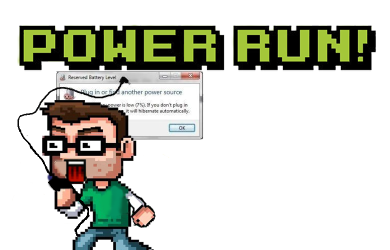
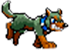
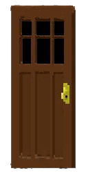
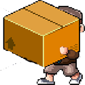
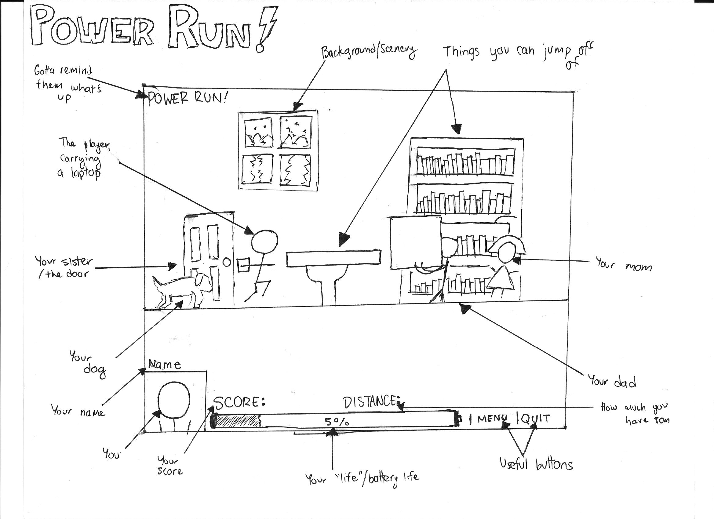

# Programming Assignment 5 - Power Run!
----

## Overview

We've all been there.
You are using your laptop in the living room when you a popup notifies you that your laptop's battery life is low.
The whole premise of the game is that you are trying to run to your laptop charger before your laptop dies.
Along the way, you will run in many obstacles that may slow you down and stop you from reaching your goal.
This is an **endless running game** - very similar to something like Temple Run or Doodle Jump.
I also plan on (hopefully) making this game into an 8 bit, arcade sort of feel.

##General Game Mechanics
The screen will constantly be moving to right, to simulate that you are always _running._
However, you are able to control the speed at which you running (faster or slower) while you are still in the screen.
If you stop using your controls, your character will "run in place" from where you left the character.
Your **life** will be determined by your **battery life.** The game **ends** when you are at **0%.**
> Example: Being at 5% battery life is the equivalent of you having 5 "hearts" or "lives." When you lose a life, you will be "dropped" back into the game, with the same score.
You will **play** the game using your **keyboard arrow keys.**
> Up is Jump, Down is duck, left is run slower, right is run faster. You can also hit "p" to pause/go to the menu.
The **score** will automatically keep increasing. The **longer** you are playing, the **faster** your score increases. You cannot lose points.


## The 5 Different Items
##### 1. Your Dog

> Your dog will randomly appear from behind you, chase you, and bark. If your dog catches you, you will be distracted and thus want to pet it, causing you to lose a "life." 

##### 2. Your Mom

> Your mom will randomly appear on screen moving back and forth, calling for your name. If you run into your mom, your mom will demand you do a chore, causing you to lose a "life."

##### 3. Doors

> Your sister likes tends to forget a lot of stuff, so she will randomly open and close doors while she searches for her items in the background. If you run into an open door, you will hurt yourself, causing you to lose a "life."

##### 4. Your Dad

> Your dad will randomly be running towards you carrying a tv over his head. He's not trying to find you, but if you don't duck, you will hit the TV, and you will lose a "life."

##### 5. Battery

> You might be running low on energy, but batteries luckily give you a life, an extra 1000 points, AND temporary invincibility!


## Example Gameplay Screen

----
----
----

# Game Design Document
This is a place holder for your game design document. You are advised to write your document in [Markdown](http://daringfireball.net/projects/markdown/) and the following section will show you how to write a document using Markdown markup.

Alternativley, you can write your document in plain text if you wish.

----

## Markdown
Markdown is a human-readable structured plain text format that is used to convert text into HTML. GitHub automatically renders Markdown into HTML.

This is a crash course on how to use Markdown. The following section will show you the plain text used to generate the document shown in the rendering section.

### Code

```
# Header 1
## Header 2
### Header 3
#### Header 4
##### Header 5

You can also write in **bold** or _italics_. You can also ~~strike through~~ or write inline `Code Segments`

>Blockquotes are done as such.

Just make sure to separate paragraphs with an emptyline. 
Otherwise, they are considered in the same paragraph.

You link to [Google](https://www.google.com) as such and lists are written has follows:
  1. First you indent with two empty spaces.
  1. Then, you use:
    * `1.` to signal an ordered (i.e. numbered) list, or
    * `*`, `-`, `+` to represent an unordered list.
      1. Make sure to maintain indentation
      1. As it is used to identify sub-lists
  1. Numbering and symboles don't matter as they are auto-generated later.

Tables are pretty easy to make:

| Tables        | Are           | Easy          |
| ------------- |:-------------:| -------------:|
| left-aligned  | centered      | right-aligned |
| header are    | bolded and    | centered      |
| zebra stripes | are neat      | 1             |


Images are added inline by using the following syntax

```

----

### Rendering
This section shows the rendering of the plain text above.

# Header 1
## Header 2
### Header 3
#### Header 4
##### Header 5

You can also write in **bold** or _italics_. You can also ~~strike through~~ or write inline `Code Segments`

>Blockquotes are done as such.

Just make sure to separate paragraphs with an emptyline. 
Otherwise, they are considered in the same paragraph.

You link to [Google](https://www.google.com) as such and lists are written has follows:
  1. First you indent with two empty spaces.
  1. Then, you use:
    * `1.` to signal an ordered (i.e. numbered) list, or
    * `*`, `-`, `+` to represent an unordered list.
      1. Make sure to maintain indentation
      1. As it is used to identify sub-lists
  1. Numbering and symboles don't matter as they are auto-generated later.

Tables are pretty easy to make:

| Tables        | Are           | Easy          |
| ------------- |:-------------:| -------------:|
| left-aligned  | centered      | right-aligned |
| header are    | bolded and    | centered      |
| zebra stripes | are neat      | 1             |


Images are added inline by using the following syntax


