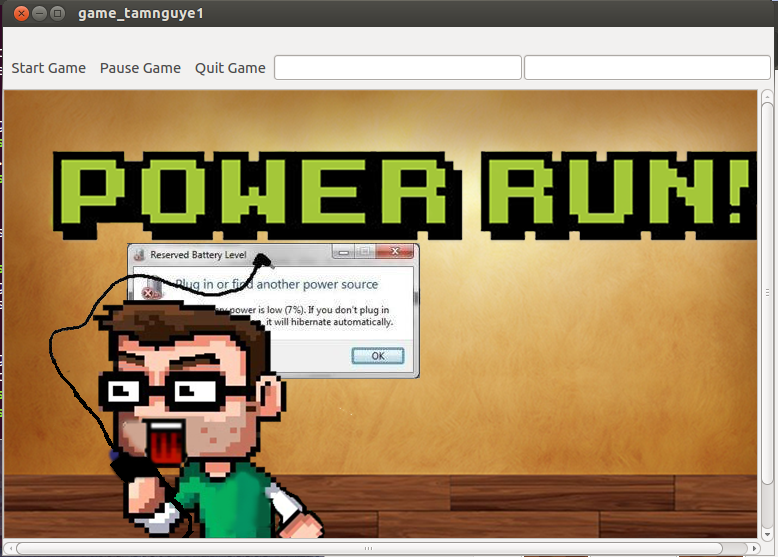
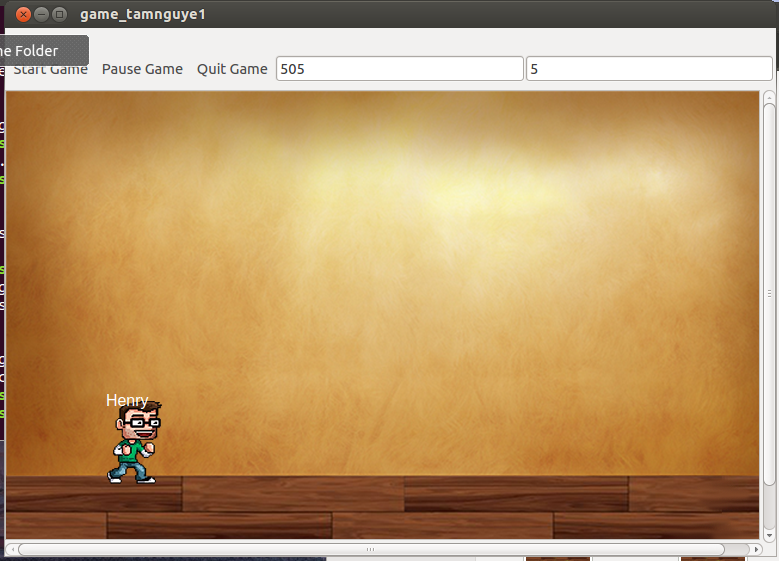
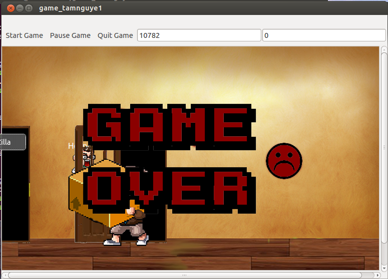

# Game - Programming Assignments Private Repository
### Student Information
  + Name: Tam Henry Le Nguyen
  + USC Email: tamnguye@usc.edu
  + USC ID: 6154285255

### Game Information
  + Game Name: Power Run!
  + Game Description: Uh Oh. Your battery's running low...
  + [Game Design Doc](GameDesignDoc.md)


### Compile & Run Instructions
The grader should use the following procedure to compile and run the code:
```shell
#Compile Instructions
echo "qmake -project"
echo "qmake"
echo "make"
#Doxygen Instructions
echo "Write command here"
#Command to run
echo "./game_tamnguye"
```

### Screenshots -- [Optional]



